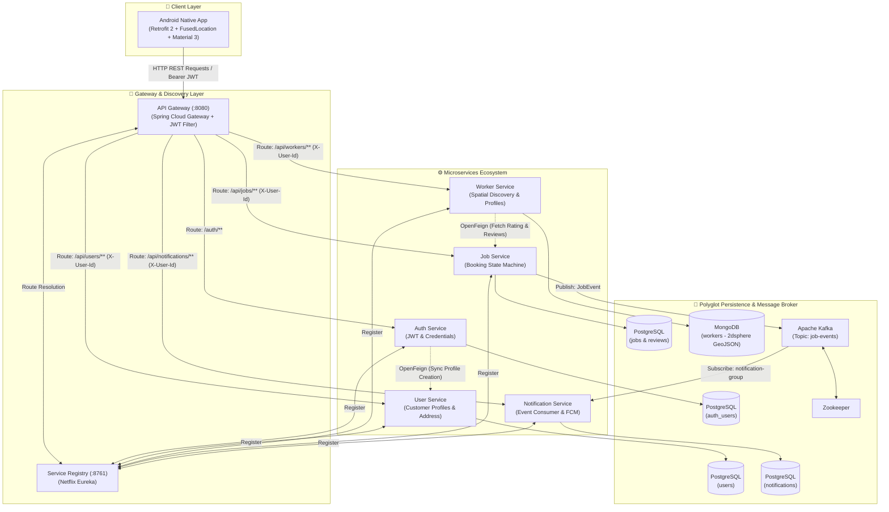
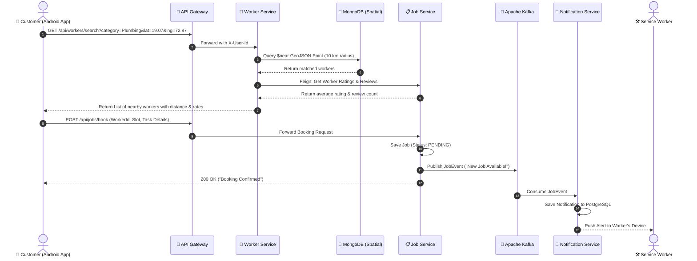

# ForSeva (फॉर-सेवा) 🛠️📱
### *Hyper-Local On-Demand Marketplace for Blue-Collar Services*

[](https://www.oracle.com/java/)
[](https://spring.io/projects/spring-boot)
[](https://spring.io/projects/spring-cloud)
[](https://developer.android.com/)
[](https://kafka.apache.org/)
[](https://www.postgresql.org/)
[](https://www.mongodb.com/)
[](https://www.docker.com/)
[](https://www.jenkins.io/)

---

## 📌 Executive Pitch & Problem Statement

### 🚨 The Problem
In emerging markets like **India**, everyday household maintenance—such as fixing a leaky faucet, emergency electrical wiring, air conditioning repairs, appliance troubleshooting, house painting, deep cleaning, or pest control—remains a **deeply fragmented, unorganized, and opaque ecosystem**.

* **Consumer Pain Points:**
  - **High Search Friction:** Locating qualified technicians in a local neighborhood is challenging and relies heavily on unvetted word-of-mouth.
  - **Arbitrary & Inflated Pricing:** Without standardized pricing or competition, consumers are frequently overcharged for basic services.
  - **Lack of Trust & Accountability:** No centralized verification, ratings, background checks, or documented work history.
  - **No Scheduling Flexibility:** Inability to book fixed time slots with assured worker availability.

* **Worker (Service Professional) Pain Points:**
  - **Limited Market Reach:** Skilled blue-collar workers (plumbers, electricians, technicians) are restricted to immediate street networks.
  - **Intermediary Exploitation:** Middlemen and local contractors take substantial commissions off worker wages.
  - **Absence of Digital Identity:** Workers lack a formal platform to showcase their customer reviews, experience, and hourly rates.

---

### 💡 The ForSeva Solution
**ForSeva** (*Service For All*) is an on-demand, hyper-local two-sided marketplace designed to bring digital transparency, fair pricing, and effortless accessibility to household services.

1. **Hyper-Local Discovery (10–15 km Radius):** Consumers instantly discover verified service professionals nearest to their GPS location using geospatial matching.
2. **Empowerment Through Choice:** Consumers compare multiple nearby workers based on **transparent hourly rates**, **verified experience (years)**, **live customer reviews**, and **star ratings**.
3. **Slot-Based Scheduled Booking:** Customers select preferred time slots, provide job details, and receive real-time updates as their job moves through lifecycle stages.
4. **Direct Economic Empowerment:** Blue-collar micro-entrepreneurs build a digital identity, gain continuous customer leads with 0% middleman extortion, and take full control of their hourly rates and work schedule.

---

## 🚀 Key Platform Features

### 🔐 1. Centralized Edge Security & Auth
- **Microservice Perimeter Security:** Single entry point managed by **Spring Cloud Gateway**.
- **Stateless JWT Authentication:** Secure token generation, validation, and claim extraction at the gateway.
- **Identity Propagation:** Gateways strip sensitive auth tokens and inject verified downstream headers (`X-User-Id`, `X-User-Role`) to microservices.
- **BCrypt Encryption:** Industry-standard password hashing in PostgreSQL.

### 📍 2. Hyper-Local Geospatial Discovery
- **MongoDB 2dsphere Spatial Indexing:** Leverages GeoJSON coordinates (`Point [longitude, latitude]`) with MongoDB `$near` queries.
- **Dynamic Proximity Calculation:** Haversine algorithm calculation provides precise distance estimates (e.g., `2.4 km away`).
- **Category & Sub-Service Filtering:** Granular hierarchy (e.g., *Electrician* ➔ *AC Repair*, *Switch Replacement*; *Plumbing* ➔ *Tap Leakage*, *Pipe Blockage*).

### 📅 3. Real-Time Booking & Job State Machine
- **Lifecycle Transitions:** Robust state management (`PENDING` ➔ `ACCEPTED` ➔ `COMPLETED` / `CANCELED`).
- **Scheduled Slot Allocation:** ISO-8601 compliant datetime booking with automated customer & worker coordination.
- **Dual Perspective Views:** Separate booking history and task management views for customers and workers.

### ⭐ 4. Social Proof, Ratings & Feedback
- **Verified Review Submission:** Double-blind customer feedback allowed only after jobs transition to `COMPLETED`.
- **Dynamic Aggregate Ratings:** Real-time calculation of worker average star ratings (`1.0` to `5.0`).
- **Top Reviews Feed:** Feign-orchestrated preview of recent reviews, ratings, and customer comments on worker detail profiles.

### 🔔 5. Asynchronous Event-Driven Notifications
- **Apache Kafka Message Broker:** Zero-latency event publishing on the `job-events` topic for every status update.
- **Non-Blocking Architecture:** Notification processing runs independently from core booking transactions.
- **In-App Notification Center:** Unread count indicators, read/unread status updates, and ready integration with **Firebase Cloud Messaging (FCM)**.

### 📱 6. Modern Android Client Experience
- **Native Android App (Java):** Responsive Material Design 3 components, Bottom Navigation, and dynamic category grids.
- **Google Play FusedLocationProvider:** Seamless one-tap GPS coordinate acquisition for accurate nearby searches.
- **Image Optimization:** Integrated with **Glide** for smooth image caching and circular avatar transformations.
- **Network Resilience:** Powered by **Retrofit 2** and **OkHttp** interceptors for automated JWT header attachment.

---

## 🏗️ System Architecture

ForSeva follows a microservices architecture. All client requests pass through a central API Gateway which resolves routes dynamically through Eureka Service Discovery. Asynchronous notifications are decoupled via Apache Kafka.



---

## 🔄 End-to-End Workflow Diagrams

### 1. Worker Discovery & Booking Flow



---

## 💻 Tech Stack Deep Dive

| Domain | Technology / Library | Purpose & Implementation |
| :--- | :--- | :--- |
| **Mobile Client** | **Android SDK (Java 11 / Target SDK 34)** | Native, responsive mobile application for customers and workers |
| | **Retrofit 2 & OkHttp 3** | Type-safe REST client with automatic JWT Authorization interceptor |
| | **Google Play Location Services** | FusedLocationProviderClient for high-accuracy GPS proximity search |
| | **Glide 4** | High-performance image loading, caching, and circular avatar rendering |
| | **Material Design 3** | Bottom Navigation, TextInputLayout, Cards, and BottomSheets |
| **Backend Framework** | **Java 21 & Spring Boot 3.x** | High-throughput, modern enterprise Java microservices framework |
| | **Spring Cloud Gateway** | Reactive edge reverse proxy, rate limiting, and JWT perimeter filter |
| | **Spring Cloud Netflix Eureka** | Dynamic service registration and client-side load balancing (`lb://`) |
| | **Spring Cloud OpenFeign** | Declarative HTTP client for synchronous inter-microservice communication |
| | **Spring Security & JJWT (0.11.5)**| Stateless authentication, BCrypt password hashing, and token parsing |
| **Message Streaming** | **Apache Kafka 7.5 (Confluent)** | High-throughput event streaming platform for decoupled job status updates |
| | **Spring-Kafka & Jackson** | JSON serialization and deserialization across producer & consumer groups |
| **Databases** | **PostgreSQL (Neon Cloud / Docker)** | Relational ACID storage for Auth, User Profiles, Jobs, and Notifications |
| | **MongoDB 6.x** | Document database with `2dsphere` spatial indexing for geospatial queries |
| | **Spring Data JPA / Hibernate** | Object-Relational Mapping (ORM) and schema auto-migration |
| **DevOps & CI/CD** | **Docker & Docker Compose** | Multi-container microservices orchestration and local environment parity |
| | **Jenkins (Declarative Pipeline)** | Automated multi-stage CI/CD pipeline (Checkout ➔ Build ➔ Containerize ➔ Deploy) |
| | **Git & GitHub** | Distributed source version control and branching workflow |

---

## 📦 Microservices Architecture Breakdown

```
ForSeva Application Ecosystem
├── [APIGateway]             (:8080) -> Gateway router, JWT filter, edge rate-limiting
├── [service-registry]       (:8761) -> Eureka Service Discovery & heartbeats
├── [Auth-Service]                   -> User signup, BCrypt hashing, JWT issuance
├── [UserService]                    -> Customer profile management & address tracking
├── [Woker-Service]                  -> Worker onboarding & MongoDB GeoJSON proximity search
├── [Job-Service]                    -> Booking state machine, ratings & Kafka event producer
└── [Notification-Service]           -> Kafka event consumer, notification history & FCM alerts
```

### Microservice Directory Map & Responsibilities

1. **`APIGateway` (Port `8080`):**
   - Routes `/auth/**`, `/api/users/**`, `/api/workers/**`, `/api/jobs/**`, and `/api/notifications/**`.
   - Intercepts requests, validates JWT signature against secret key, and propagates `X-User-Id` and `X-User-Role` headers.
2. **`service-registry` (Port `8761`):**
   - Netflix Eureka server acting as the central telephone exchange for dynamic microservice discovery.
3. **`Auth-Service`:**
   - Handles `/auth/signup` and `/auth/login`.
   - On signup, coordinates synchronous profile registration in `UserService` via OpenFeign with transactional rollback safety.
4. **`UserService`:**
   - Manages customer profile data, phone numbers, and coordinate-aware address models.
5. **`Woker-Service`:**
   - Stores worker skills, experience years, hourly rates, bio, and geographic point coordinates in MongoDB.
   - Executes spatial proximity queries (`$near`) and maps distance calculations.
6. **`Job-Service`:**
   - Core booking transactional engine. Manages job creation, status updates (`ACCEPTED`, `COMPLETED`, `CANCELED`), review submission, and worker average rating queries.
   - Publishes `JobEvent` payloads to Kafka on every transition.
7. **`Notification-Service`:**
   - Subscribes to the `job-events` Kafka topic with consumer group `notification-group`.
   - Persists notification history to PostgreSQL for the in-app notification bell and dispatches push alerts.

---

## 📂 Project Structure

```text
ForSevaApplication/
│
├── ForSeva Backend/                     # Microservices Root (Maven Multi-Module)
│   ├── APIGateway/                      # Spring Cloud Gateway Service
│   │   ├── src/main/java/.../APIGateway/# Gateway Application & JWT Filter
│   │   ├── Dockerfile
│   │   └── pom.xml
│   ├── Auth-Service/                    # Authentication & Token Service
│   │   ├── src/main/java/.../Auth_Service/
│   │   ├── Dockerfile
│   │   └── pom.xml
│   ├── Job-Service/                     # Booking Engine & Kafka Producer
│   │   ├── src/main/java/.../Job_Service/
│   │   ├── Dockerfile
│   │   └── pom.xml
│   ├── Notification-Service/            # Notification Engine & Kafka Consumer
│   │   ├── src/main/java/.../Notification_Service/
│   │   ├── Dockerfile
│   │   └── pom.xml
│   ├── UserService/                     # Customer Profile Service
│   │   ├── src/main/java/.../UserService/
│   │   ├── Dockerfile
│   │   └── pom.xml
│   ├── Woker-Service/                   # Worker Onboarding & Spatial Discovery
│   │   ├── src/main/java/.../Woker_Service/
│   │   ├── Dockerfile
│   │   └── pom.xml
│   ├── service-registry/                # Netflix Eureka Service Discovery
│   │   ├── src/main/java/.../service_registry/
│   │   ├── Dockerfile
│   │   └── pom.xml
│   ├── docker-compose.yml               # Multi-service Orchestration Manifest
│   ├── Jenkinsfile                      # Automated CI/CD Pipeline
│   └── pom.xml                          # Parent Maven POM
│
├── ForSeva Android/                     # Mobile Client Root
│   └── Forseva/                         # Android Studio Project
│       ├── app/
│       │   ├── src/main/
│       │   │   ├── java/com/example/forseva/
│       │   │   │   ├── Activity/        # Activities, Fragments & Adapters
│       │   │   │   │   ├── HomeActivity.java
│       │   │   │   │   ├── HomeFragment.java
│       │   │   │   │   ├── WorkerSearchActivity.java
│       │   │   │   │   ├── WorkerDetailActivity.java
│       │   │   │   │   ├── BookingDetailActivity.java
│       │   │   │   │   ├── BookingsFragment.java
│       │   │   │   │   ├── ProfileFragment.java
│       │   │   │   │   └── NotificationActivity.java
│       │   │   │   ├── Client/          # Retrofit Client & Interceptors
│       │   │   │   ├── DTO/             # Data Transfer Objects
│       │   │   │   ├── Manager/         # TokenManager & Session State
│       │   │   │   ├── Model/           # Domain Models
│       │   │   │   └── Service/         # Retrofit API Interfaces
│       │   │   ├── res/                 # Layouts, Drawables, Values & Navigations
│       │   │   └── AndroidManifest.xml
│       │   ├── build.gradle.kts
│       │   └── proguard-rules.pro
│       ├── build.gradle.kts
│       └── settings.gradle.kts
│
├── LICENSE
└── README.md                            # Comprehensive Project Documentation
```

---

## ⚙️ Getting Started & Local Setup

### 📋 Prerequisites
- **Java Development Kit (JDK 21)**
- **Apache Maven 3.9+**
- **Docker Desktop & Docker Compose**
- **Android Studio (Hedgehog / Iguana or newer)**
- **Android Virtual Device (AVD) or Physical Android Device (Android 12+ / API 31+)**

---

### 1️⃣ Setting Up Environment Variables
Create the necessary `.env` files in `ForSeva Backend/` or supply them via Docker environment configurations:

```ini
# Database & Secrets Configuration
JWT_SECRET=YourSuperSecretKeyForJWTTokenSigningMustBeLongEnough256Bits
EUREKA_SERVER_URL=http://service-registry:8761/eureka
EUREKA_HOSTNAME=service-registry
SPRING_KAFKA_BOOTSTRAP_SERVERS=kafka:9092

# PostgreSQL Connection (Neon Cloud or Local Postgres)
NEON_URI=jdbc:postgresql://<host>:5432/<dbname>?sslmode=require
NEON_USER=<db_username>
NEON_PASS=<db_password>

# MongoDB Connection
URI=mongodb://<host>:27017/forseva_db
DB=forseva_db
```

---

### 2️⃣ Running the Backend via Docker Compose
To build and launch all 8 backend containers (Zookeeper, Kafka, Eureka, API Gateway, and 5 Microservices) with one command:

```bash
cd "ForSeva Backend"

# 1. Package all Spring Boot JARs
mvn clean package -DskipTests

# 2. Build and launch Docker containers in detached mode
docker-compose up --build -d
```

Verify service health:
- **Eureka Dashboard:** `http://localhost:8761`
- **API Gateway:** `http://localhost:8080`
- **Kafka Broker:** `localhost:9092`

---

### 3️⃣ Running the Android Client
1. Open **Android Studio** and select **Open** ➔ Navigate to `ForSeva Android/Forseva`.
2. Configure the Backend Gateway IP in `RetrofitClient.java`:
   - If using the **Android Emulator**: `http://10.0.2.2:8080/`
   - If using a **Physical Device**: `http://<YOUR_PC_LAN_IP>:8080/` (Ensure PC and phone are on the same Wi-Fi network).
3. Click **Sync Project with Gradle Files**.
4. Press **Run (Shift + F10)** on your target device or emulator.

---

## 🚢 CI/CD Pipeline (Jenkins)

The project includes an enterprise-grade automated `Jenkinsfile` pipeline that builds, packages, containerizes, and deploys the backend services upon every code commit.

```text
[Pipeline]
  ├── Stage 1: Checkout Source Code (SCM)
  ├── Stage 2: Verify Toolchain (Java 21, Maven 3, Docker, Docker Compose)
  ├── Stage 3: Build Spring Boot JARs ('mvn clean package -DskipTests')
  ├── Stage 4: Build Docker Images ('docker-compose build')
  └── Stage 5: Zero-Downtime Container Deployment ('docker-compose up -d')
```

---

## 🌟 Key Engineering Contributions & Highlights

- **Distributed Architecture Design:** Designed and developed an event-driven, polyglot microservices system utilizing Spring Cloud and Apache Kafka.
- **Geospatial Proximity Matching:** Implemented high-performance MongoDB `$near` indexing and Haversine distance computations to enable sub-second hyper-local worker search.
- **Edge Security & Routing:** Implemented edge-level token validation on Spring Cloud Gateway with dynamic downstream header propagation.
- **Asynchronous Event Pipelines:** Decoupled critical booking transactions from notifications using Apache Kafka, ensuring high fault tolerance and zero transaction blocking.
- **Mobile-First Client:** Built a native Android client featuring GPS integration, session management, and asynchronous Retrofit communication.
- **Containerization & CI/CD:** Orchestrated multi-container Docker environments and established an automated Jenkins deployment pipeline.

---

## 📄 License
This project is licensed under the MIT License - see the [LICENSE](file:///c:/Users/sujal/ForSevaApplication/LICENSE) file for details.

---

<p align="center">
  <b>ForSeva</b> — <i>Empowering local service professionals and simplifying home maintenance for everyone.</i>
</p>
